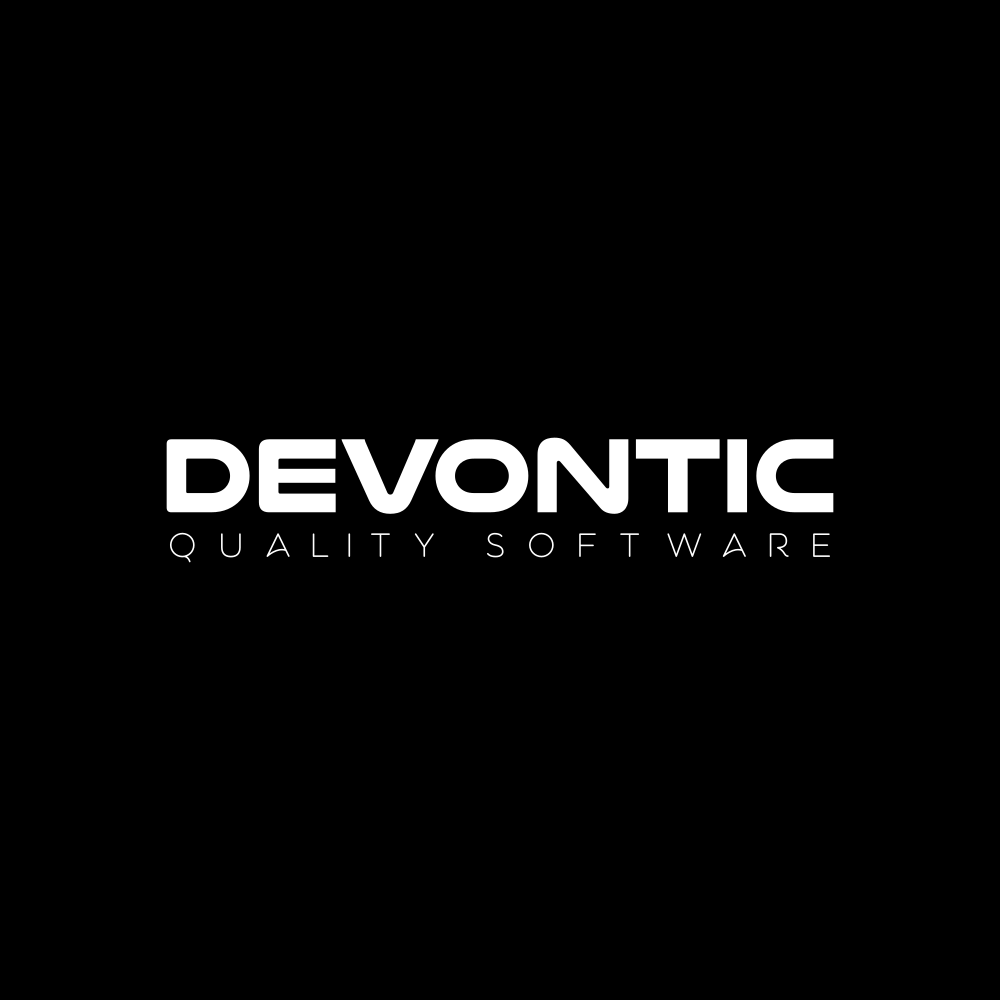

# Prueba técnica — Net developer

# Introducción
En este documento se explicará la prueba a desarrollar para valorar las habilidades del candidato.
Concepto
El concepto de la prueba es muy sencillo.
El candidato tiene dos opciones en las que basar dicha prueba
-	Un sistema de ticketing, en el que se puedan crear nuevos tickets, editar tickets, obtener comentarios y documentos en base a un ticket, y poder borrar tickets.
-	Un sistema de Pedidos, en el que se puedan insertar nuevos pedidos, editar pedidos, eliminar pedidos, consultar los productos que contiene un pedido, así como poder obtener pedidos en base a los productos y una cantidad determinada.

# BBDD
Para la base de datos, se pide al candidato realizar un diseño sencillo pero que cumpla con los requisitos. No es necesario aplicar sobreingeniería ni nada fuera de lo que se pide. Por ejemplo, para la primera opción (Ticketing) podríamos tener las siguientes tablas
Ticket > TicketAttachments > TicketItems 
En el caso de un sistema de pedidos, podríamos tener las siguientes tablas
Pedido > LineaPedido > Productos 
La elaboración del esquema es totalmente a cargo del usuario, decidiendo que implementar para el correcto funcionamiento.
La bbdd debe de ser preferiblemente en SQL SERVER, aunque si el candidato considera usar un servicio de terceros para instanciar la BBDD no hay mayor problema, con tener acceso para valorarla es suficiente.
También será suficiente con un script de base de datos para poder importarla y poder valorarla.
# API
Se pide la implementación de una api desarrollada con NET CORE (V5 o V6) en la que se haga uso de las siguientes características :
-	LINQ TO ENTITIES
-	EF Code first
-	SWAGGER
-	Principios SOLID
-	DDD (Domáin drive design)
-	Inyección de dependencias
Se valorará positivamente el incluir test unitarios, así como todas aquellas soluciones que el candidato considere que ayudan a mejorar el código, tanto a nivel lógico como a nivel visual.
Se tendrán en cuenta todas las soluciones aportadas por el candidato, aunque estas no funcionen correctamente (si se diera el caso). Al final la idea es valorar el conjunto de habilidades de las que dispone el candidato para el día a día.
No se requiere que la api tenga ningún FRONTEND, todas las comprobaciones se harán mediante swagger.

Entregable
El candidato deberá de crear un repositorio en github con todos los ficheros que compongan su prueba técnica, y avisar para proceder a su evaluación

> Happy coding!

